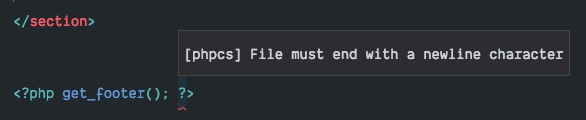
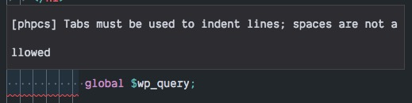

# WordPress Development Linting for teams with VS Code
This guide will help you get started with best practices for WordPress development using VS Code.



## Prerequisites 
### Global dependencies
- install [VS Code](https://code.visualstudio.com/download)
- install [Composer](https://getcomposer.org/download/), which is a package manager for PHP applications

Once you have Composer installed, run the following commands to install needed packages globally on your machine.

- [PHP_CodeSniffer](https://github.com/squizlabs/PHP_CodeSniffer) with `composer global require "squizlabs/php_codesniffer=*"`
- [Wordpress Coding Standards](https://github.com/WordPress-Coding-Standards/WordPress-Coding-Standards) with `composer global require "wp-coding-standards/wpcs"`

You then need to add the Composer `bin` directory to your terminal's `PATH`. If you're using the default bash shell on macOS, this can by adding the following item to your `~/.bash_profile` profile (If you are not using the default bash shell on macOS, we'll trust you're experienced enough to add the correct path inclusion to your shell's configuration file):

- `~/.composer/vendor/bin`

Your `PATH` variable will then look something like this:

- `/usr/local/bin:/usr/bin:~/.composer/vendor/bin`

If you need a guide on how the `PATH` variable works, you can [read about it here](https://medium.com/@jalendport/what-exactly-is-your-shell-path-2f076f02deb4)


To ensure that everything is installed correctly, open a new terminal shell and run the command `phpcs -i`. You should get output similar to the following which includes `Wordpress-Extra`, the standard we'll be implementing.

```
The installed coding standards are PEAR, Zend, PSR2, MySource, Squiz, PSR1, PSR12, WordPress-VIP, WordPress, WordPress-Extra, WordPress-Docs and WordPress-Core
```


### Necessary VS Code Extensions
The following extensions should be searched and installed via the VS Code Extensions panel (`Command + Shift + X`).

- `EditorCongig for VS Code`
- `phpcs`

Once these extensions are installed, you will need to either reload your VS Code workspace or quit and relaunch the application.

##Setup

### Exclusions
There are some directories that we do not want to lint with `phpcs` because they do not represent our own code and we cannot guarantee their level of quality. In your VS Code User Settings (`Command + ,`), add the following block of exceptions:

```
"phpcs.ignorePatterns": [
    "*/vendor/*",
    "*/wp-admin/*",
    "*/wp-includes/*",
    "*/node_modules/*"
],
```
This will prevent `phpcs` from barking at you for things you can't control. Win!

### Per-Project
#### phpcs.xml
At the root of your project directory you'll want to include a `phpcs.xml` file. This file tells `phpcs` which set of rules to use to validate your project's code. There is an example WordPress [phpcs.xml](phpcs.xml) file included in this directory.

**Note that when you open a project in VS Code, you must open it from the root where your `phpcs.xml` exists in order for linting to use your project settings correctly**

If your `phpcs.xml` is in the root of your git repo, but you open the `wp-content/themes` directory directly in your editor, then VS Code will not find your `phpcs.xml` file and your linting will uses default settings and not the WordPress specific settings.

#### editorconfig
the `editorconfig` file also goes in the root of your project directory. This tells your editor what preferences to default to on a project for tabs vs spaces, level of indention, whether new lines should be required at the end of files, etc.

There is an example [editorconfig](editorconfig) file included in this repo.

## Verifying 
Once you have installed the prerequisites, added the `phpcs.xml` and `editorconfig` files to your project root, and opened your project in VS Code (ensuring that you're opening it from the root and not a subdirectory in your project) then you should now have linting in place as prescribed by the WordPress coding standards. An easy way to check this is working is to ensure that your editor now barks at you for using spaces for your `.php` files instead of tabs. Yes, spaces are usually correct for indentation, but that's the WordPress coding standards for you. `¯\_(ツ)_/¯`

